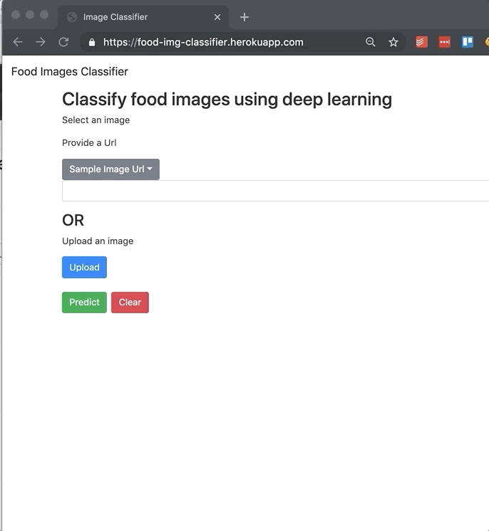

# Training the Image Classifier & Creating a Web App
## Our example:  Food Images Classifier

## Citation Note
If you do use our blog or GitHub repos to create your own web or mobile app, we would appreciate it if you would give our work attribution by sharing the below citation:  
>Pattaniyil, Nidhin and Shaikh, Reshama, [Deploying Deep Learning Models On Web And Mobile](https://reshamas.github.io/deploying-deep-learning-models-on-web-and-mobile/), 2019

This project was completed jointly by [Nidhin Pattaniyil](https://www.linkedin.com/in/nidhinpattaniyil/) and [Reshama Shaikh](https://reshamas.github.io).

The following were used for model **training** (see [requirements.txt](requirements.txt)):    
- fastai:  version 1.0.42
- PyTorch:  version  1.0.0
- Python:  version 3.6

The following were used for model **deployment**:    
- Heroku
- Flask:  version 1.0
 

## Table of Contents
1.  [Training the Model](docs/1_training.md) using fastai:  [food classifier notebook](https://github.com/npatta01/food-classifier/blob/master/notebooks/1_train.ipynb)
2.  [Deploying the App on Heroku](docs/2_heroku_app.md):  our web app is [**food-img-classifier.herokuapp.com**](https://food-img-classifier.herokuapp.com)
3.  Deploying a Mobile App, see this repo:  [npatta01/mobile-deep-learning-classifier](https://github.com/npatta01/mobile-deep-learning-classifier)

## Demo

 

 

 
 
 

